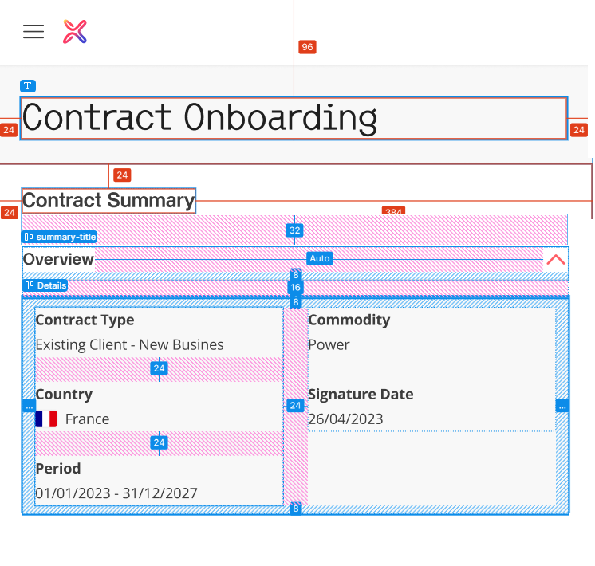

# Coding Challenge Requirements


## Overview

Build a responsive “Contract Onboarding” page based on the provided reference image. Implement an accessible, reusable accordion component that toggles expand/collapse when clicking the red chevron/arrow. Render this accordion component two times on the page, each showing a contract summary block.

You may use any frontend stack. Blazor is preferred

## Requirements

- [x] Header with logo and page title “Contract Onboarding”
- [x] Section title: “Contract Summary”
- [x] Reusable Accordion component:
  - [x] Props: Title, ChildContent (or equivalent)
  - [x] Toggle expand/collapse by clicking the red chevron button
  - [x] Used 2 times, each labeled “Overview”
- [x] Accordion content (when expanded) shows:
  - [x] Contract Type: “Existing Client – New Business”
  - [x] Commodity: “Power”
  - [x] Country: “France” + flag icon from /icons
  - [x] Signature Date: “26/04/2023”
  - [x] Period: “01/01/2023 – 31/12/2027”

## Responsiveness

- Desktop (≥1200px): two-column grid of 2 accordions (2x1)
- Tablet (~768–1199px): two columns if space allows; otherwise one column
- Mobile (≤767px): single column; content stacks cleanly; no horizontal scroll

## Visual cues

- [x] Light page background; white/very light accordion surface with subtle border
- [x] Chevron arrow in red; rotates to indicate expanded/collapsed
- [x] Labels slightly bolder than values; consistent spacing

## Acceptance Criteria

- [x] Page shows header with logo + title and “Contract Summary”
- [x] 2 instances of the same Accordion component rendered
- [x] Truncate overflowing text (with ellipsis “…”) and provide the complete value in a tooltip on hover
- [x] Clicking the chevron expands/collapses; chevron indicates state change
- [x] Expanded content includes all five fields with correct values and flag icon
- [x] Desktop: 2-column grid; Mobile: 1-column; no layout breakage

## Specs



### Fonts

- Header ("Contract Onboarding")

```
color: var(--text-highlight, #1F1F1F);

/* Heading/Lucida Console/H3 */
font-family: "Lucida Console";
font-size: 36px;
font-style: normal;
font-weight: 300;
line-height: 110%; /* 39.6px */
letter-spacing: -0.36px;
```

- Section Title ("Contract summary")

```
color: var(--text-primary, #3D3D3D);

/* Title/M-bold */
font-family: "Lucida Console";
font-size: 20px;
font-style: normal;
font-weight: 700;
line-height: 120%; /* 24px */
letter-spacing: -0.2px;
```

- Section Title ("Overview")

```
color: var(--text-primary, #3D3D3D);

/* Title/S-bold */
font-family: "Lucida Console";
font-size: 16px;
font-style: normal;
font-weight: 700;
line-height: 24px; /* 150% */
```

### Component

- Style

```
background: var(--surface, #F8F8F8);
```

- Font bold:

```
color: var(--text-primary, #3D3D3D);

/* Body/M-bold */
font-family: "Open Sans";
font-size: 14px;
font-style: normal;
font-weight: 700;
line-height: 24px; /* 171.429% */
letter-spacing: -0.14px;
```

- Font regular:

```
color: var(--text-primary, #3D3D3D);

/* Body/M-reg */
font-family: "Open Sans";
font-size: 14px;
font-style: normal;
font-weight: 400;
line-height: 24px; /* 171.429% */
letter-spacing: -0.14px;
```
