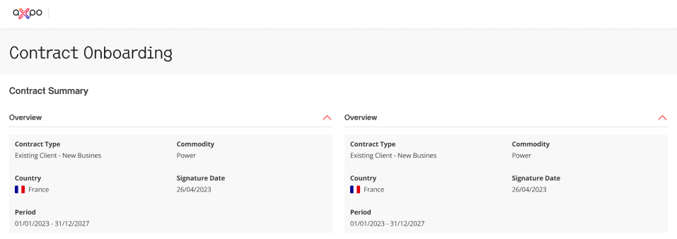

# Coding Challenge Requirements

## Overview
Build a responsive “Contract Onboarding” page based on the provided reference image. Implement an accessible, reusable accordion component that toggles expand/collapse when clicking the red chevron/arrow. Render this accordion component four times on the page, each showing a contract summary block.

You may use any frontend stack. Blazor is preferred
## Requirements